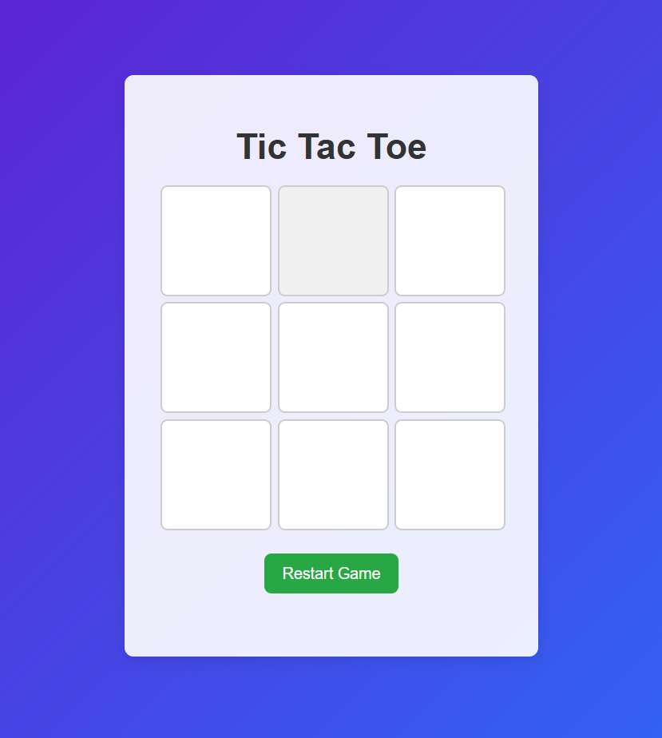
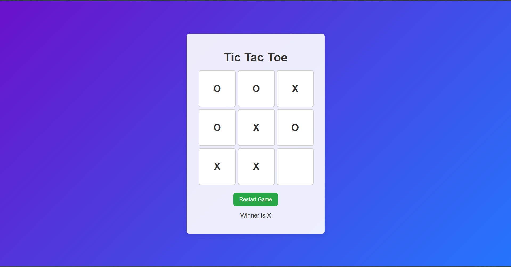
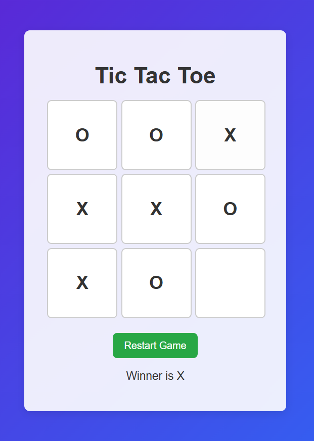

# 🎮 Tic Tac Toe Game
A beautiful, interactive Tic Tac Toe game built with modern web technologies featuring smooth animations and an intuitive user interface.

## 📸 Screenshots
<table align="center">
  <tr>
    <td align="center">
      <br/>
      <em>Home Page</em>
    </td>
    <td align="center">
      <br/>
      <em>Winner</em>
    </td>
  </tr>

  <tr>
    <td align="center">
      <br/>
      <em>Draw</em>
    </td>
  </tr>
  
</table>

  

## [Live Demo](https://tic-tac-toe-gilt-iota-41.vercel.app)

## 🌟 Features

### 🏆 **Score Tracking**
- Real-time score display
- Win/Loss/Draw statistics
- Session-based scorekeeping
- Reset score functionality

### 🎪 **User Experience**
- Responsive design for all devices
- Touch-friendly interface for mobile
- Clean and modern UI
- Game status messages

## 🛠️ Technologies Used
- **HTML5** - Semantic game structure
- **CSS3** - Animations and styling
- **JavaScript (ES6+)** - Game logic and AI
- **CSS Grid** - Game board layout

## 🚀 Getting Started

### Installation

1. **Clone the repository**
   ```bash
   git clone https://github.com/ravibhushan10/tic-tac-toe
   ```

2. **Navigate to project directory**
   ```bash
   cd tic-tac-toe
   ```

3. **Open in browser**
   ```bash
   open index.html
   ```


## Play the Game

   - Click on any empty cell to make your move
   - X always goes first
   - Take turns until someone wins or it's a draw

## 🎮 Game Rules

- Players take turns marking spaces in a 3×3 grid
- The player who succeeds in placing three marks in a horizontal, vertical, or diagonal row wins
- If all 9 squares are filled and no player has won, the game is a draw
- 


## 🤝 Contributing

### How to Contribute

1. **Fork the Repository**
   - Click the 'Fork' button at the top right of this repository
   - This creates a copy of the project in your GitHub account

2. **Clone Your Fork**
```bash
   git clone https://github.com/YOUR-USERNAME/tic-tac-toe.git
   cd tic-tac-toe
```

3. **Create a Branch**
```bash
   git checkout -b feature/AmazingFeature
```

4. **Make Your Changes**
   - Write clean, readable code
   - Follow the existing code style
   - Test your changes thoroughly

5. **Commit Your Changes**
```bash
   git add .
   git commit -m 'Add some AmazingFeature'
```

6. **Push to Your Fork**
```bash
   git push origin feature/AmazingFeature
```

7. **Open a Pull Request**
   - Go to your forked repository on GitHub (https://github.com/YOUR-USERNAME/tic-tac-toe)
   - You'll see a yellow banner saying **"Compare & pull request"** - click it
     - If you don't see the banner, click the **"Contribute"** button, then **"Open pull request"**
   - You'll be taken to the original repository's PR page
   - GitHub will automatically compare your branch with the main repository
   - Fill in the Pull Request form:
     - **Title**: Brief summary (e.g., "Add dark mode toggle feature")
     - **Description**: Explain your changes clearly:
       - What changes you made
       - Why you made them
       - Screenshots (if UI changes)
       - Related issue numbers (e.g., "Fixes #123")
   - Click **"Create pull request"**
   - Wait for review - the maintainer will review your PR and may:
     - Approve and merge it ✅
     - Request changes or improvements
     - Ask questions or provide feedback
   - Be patient and responsive to any feedback!


## 👨‍💻 Author

**Ravi Bhushan**

- LinkedIn: [https://www.linkedin.com/in/ravibhushan-kumar-55b312344](https://www.linkedin.com/in/ravibhushan-kumar-55b312344/)
- Portfolio: [https://ravibhushan-portfolio.vercel.app](https://ravibhushan-portfolio.vercel.app)
- GitHub: [@ravibhushan10](https://github.com/ravibhushan10)
- Email: ravibhushankumar87tp@gmail.com

---

<div align="center">

### ⭐ Star this repository if it helped you!

**Made with ❤️ by Ravi Bhushan**

[Live Demo](https://tic-tac-toe-gilt-iota-41.vercel.app) · [Report Bug](https://github.com/ravibhushan10/tic-tac-toe/issues) · [Request Feature](https://github.com/ravibhushan10/tic-tac-toe/issues)

---


